# CLI-V3

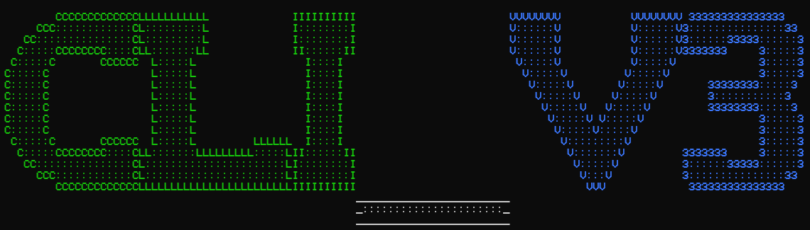

## Table of Contents
- [CLI-V3](#cli-v3)
  - [Table of Contents](#table-of-contents)
  - [What is CLI?](#what-is-cli)
  - [How can I use the other versions of CLI?](#how-can-i-use-the-other-versions-of-cli)
  - [The actual V3 docs](#the-actual-v3-docs)
    - [How to initialise a menu](#how-to-initialise-a-menu)
    - [Adding Options](#adding-options)
      - [Callable Options](#callable-options)
      - [Boolean Options](#boolean-options)
      - [Disabled Options](#disabled-options)
    - [THEMES](#themes)
      - [Custom Themes](#custom-themes)
      - [Colour Codes](#colour-codes)
  - [FAQ](#faq)
- [Dev Notes](#dev-notes)

## What is CLI?

Essentially, CLI is a framework that's designed to help you create Text-based User Interface (TUI) menus.

Yes, I know I used the wrong name, I can't be asked changing it.

## How can I use the other versions of CLI?

You can change the branch you have selected.

- With `git`
  - ```sh
    git clone https://github.com/pytmg/cli
    git checkout (version number)
    ```
  - Replace `(version number)` with any of `V0, V1, V2` or `main`
- With GitHub
  - 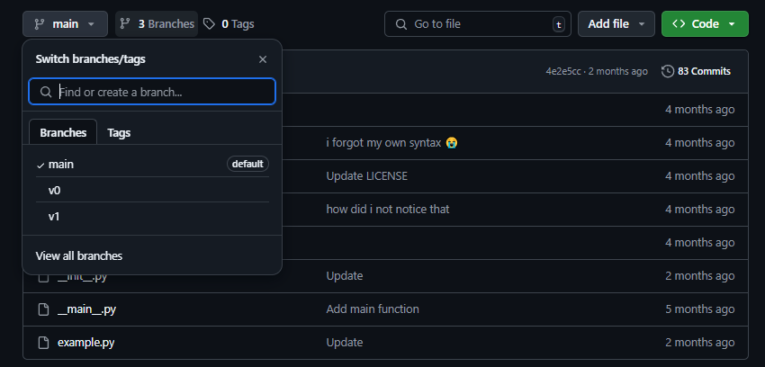
  - Then choose whichever branch you desire, then optionally go to Code and Download ZIP.

Then, check the Documentation for the version you want. (not v0, dont use v0 please i beg)

## The actual V3 docs

### How to initialise a menu

So, initialising a menu is really not that hard to do, really. All you have to know is that menus are renamed from `CLI` (CLI-V1 to 2) to `Menu` in CLI-V3 and above.

```python
from cli import Menu, Option

menu = Menu(title="My Menu")
```

### Adding Options

To have a menu, you have to have options.

```python
# assuming you've done above steps from now on

menu.AddOption(
    Option.Callable()
        name="My custom option",
        description="Wow! Options exist!",
        action=None, # you can also pass a callable function
        params=() # you can also pass parameters for said callable function
    )
)

menu() # can use menu.run() but who cares
```

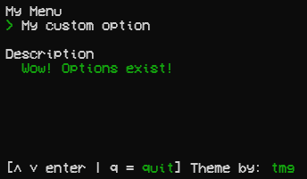

All this really does is just add an option with the name `My custom option` and a custom description, the option does nothing (oh hey you dont need a function, that's nice.)

#### Callable Options

They're options that have functions attached to them, such as `menu.print` or others.

They can run any valid function you give them.

```python
menu.AddOption(
    Option.Callable(
        name="Say hello",
        description="Hello!",
        action=menu.print,
        params=("Hello, World!",)
    )
)
```

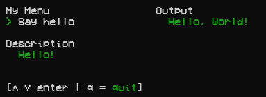

#### Boolean Options

These options are options that are just a true and false flag, you click it to change it, not much else.

Get the value with the `.value` property.

```python
menu.AddOption(
    Option.Boolean(
        name="True or False?",
        description="Let's see.."
    )
)
```

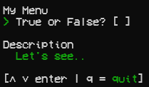

You'll notice it adds a little square on the right of the name, that's part of the theme. More on that later.

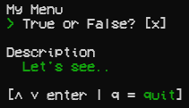

This one adds a little `x` to show its value.

#### Disabled Options

Now this is a new feature, not seen in previous versions of CLI.

This can be applied to all option types.

If you were to add `disabled=True` to an option - or `option.disabled = True` - you'd disable the option from being selected or ran. Very cool! It should also appear as a different colour.

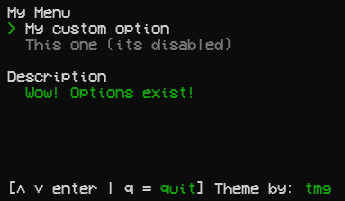

### THEMES

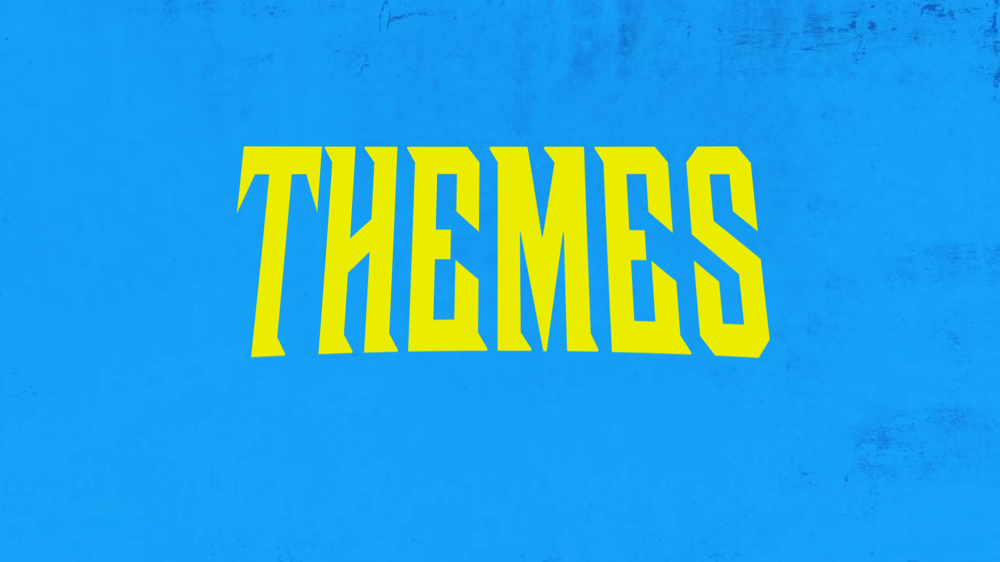

<smaller>see i woulda done it as the title, but the VSCode extension i use for the table of contents doesnt like images, so thats pretty annoying lol</smaller>

OKAY NOW THIS IS SOMETHING I'VE WANTED TO MAKE FOR A WHILE

THEMES!!!! (tada.mp3)

So, how do they work? It's really simple!

*you import Themes and set menu.theme to an initialised class.*

```python
from cli import Menu, Themes, Option

menu = Menu(title="themed menu", theme=Themes.BlueDefault())

menu.AddOption(
    Option.Callable(
        name="wow",
        description="what",
        action=None,
        params=()
    )
)

menu()
```

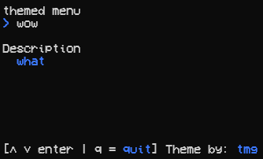

IT'S BLUE.

#### Custom Themes

It's actually VERY simple to make your own themes. VERY.

Here's an example, I'd like to call it EVERYTHING IS RED. Read the comments in the code for more of an explanation.

```python
from cli import Themes

EVERYTHINGISRED = Themes.Default() # Just the default theme, reskinned I suppose.
EVERYTHINGISRED.UPPERONLY = True # Sets everything to purely uppercase
EVERYTHINGISRED.theme_name = "EVERYTHING IS RED." # the theme name
EVERYTHINGISRED.theme_author = "/Rx/tmg//" # the author + colour | more on colours soon
EVERYTHINGISRED.theme_description = "by tmg" # description
EVERYTHINGISRED.title = "/Rx/[title]//" # title theming | [title] is the placeholder
EVERYTHINGISRED.defaultOption = "/Rx/  [option]//" # option with 2 space indent
EVERYTHINGISRED.disabledOption = "/rx/  [option]//" # darker colour
EVERYTHINGISRED.selectedOption = "/Rx/> [option]//" # option with an arrow
EVERYTHINGISRED.description = "/Rx/Description\n  /Rx/[description]//" # descriptions :D
EVERYTHINGISRED.footer = "/Rx/EVERYTHING IS /rx/RED/Rx/. - [↑ ↓ enter | q = quit]//"
```

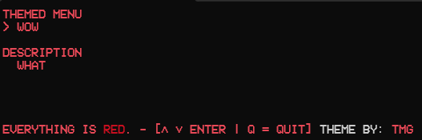

You may have noticed some weird looking codes such as /Rx/ or /rx/

What do they mean?

#### Colour Codes

These can be applied absolutely everywhere, from themes to the user-defined option name.

What are the colour codes?

Here's a neat little image to show you.

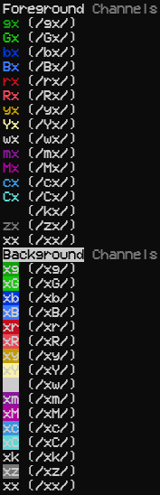

What does `x` mean?
- Don't change this colour channel. So, if `x` is in the foreground channel, it skips changing foreground colour, and if it's in the background channel, it skips changing the background colour.

## FAQ

these were never asked, probably won't ever be but who am i to skip on being schizophrenic

- Q: Why doesn't my theme work?
  - A: Two possibilities, you either messed up the colour tags, OR you didn't use `Themes.Default` as the base. Yes that matters, no it's not because I suck at coding, no it's not because I've been trying to do this for 74 hours straight and could not find a suitable replacement for the system at hand.

- Q: Is there a darkmode?
  - A: I don't know your terminal, but assuming you're a TOTALLY SANE PERSON, it should be darkmode by default. (who uses lightmode terminals)

- Q: Can I use V0?
  - Okay, come on, at the VERY least use V1. (V1 is just V0 but object-oriented)
  - If you do end up actually using V0 successfully, bravo, you're insane. Please get away from me.
  
- Q: Are you a stable programmer?
  - A: No. I have a 3 letter username.
  
- Q: What version should I use?
  - A: V3. Because V2 is a bug hellhole, V1 is.. V1 and V3 just looks nice. Come on.

- Q: Does this work on Mac?
  - A: ¯\\\_(ツ)\_/¯
  
- Q:
  - A:

- Q: Can I add submenus?
  - Not quite yet. I mean, you can, yes, but its VERY broken at the moment, I'll work on it soon.

- Q: How do I use V3?
  - A: You can start by reading the file you have open right now. Scroll up. READ.

- Q: Create a new V0 version!
  - A: this isnt even a question
  
- Q: When is V4?
  - A: Bit early for that, ain't it? Jokes aside, I do plan on working on V4 at *some* point. Dunno when, dunno how, I just know I'll do it at SOME point. (trust)

---

# Dev Notes

- code
- dont code after 11 pm you will have a heart attack
- colour code parser may be sentient, oops
- TODO: create an eyesore theme
- TODO: get more than 23 minutes of sleep
- TODO: scrap that i need to work on the submenu support